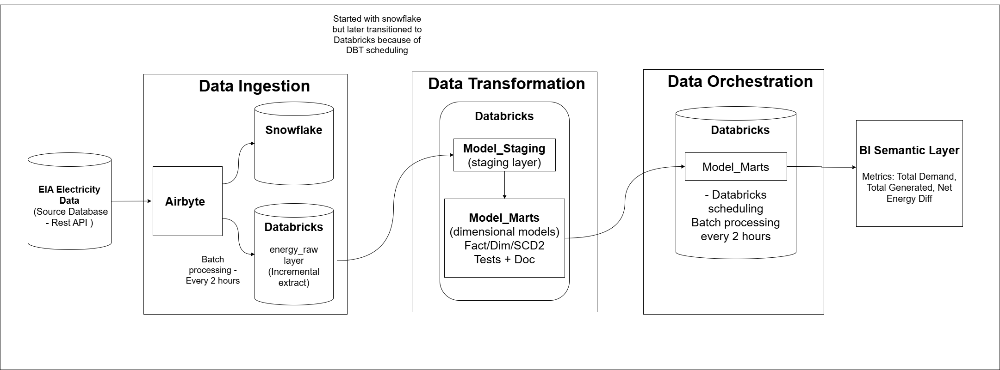
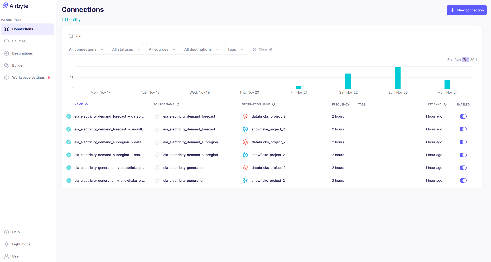
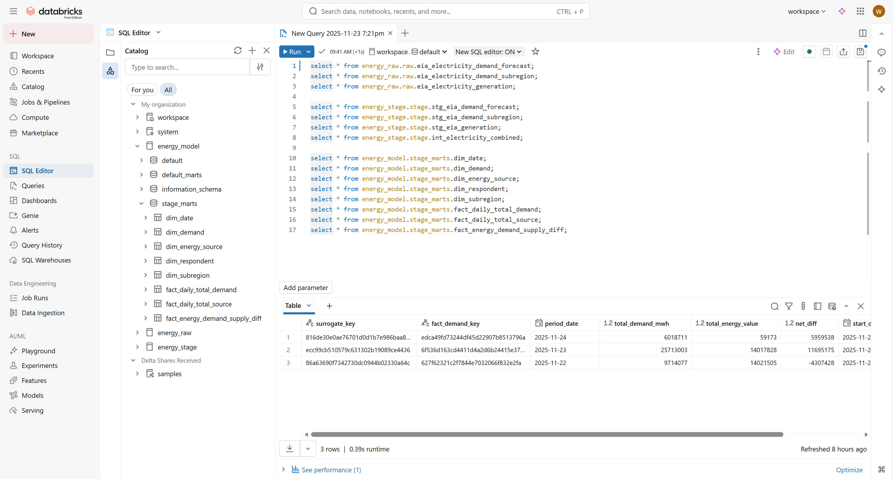
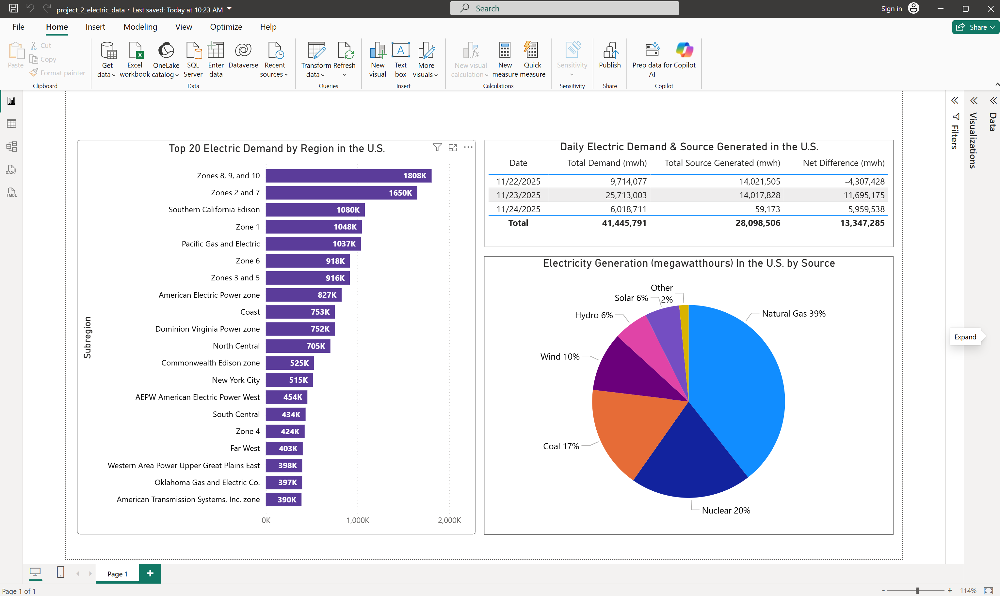
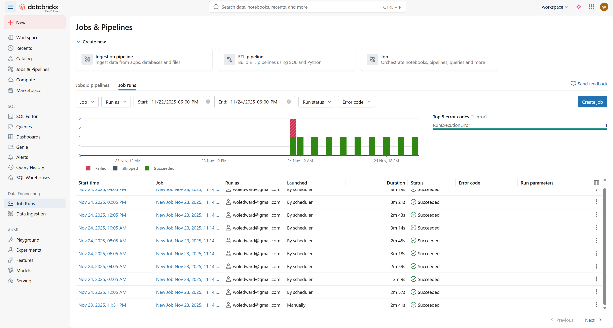
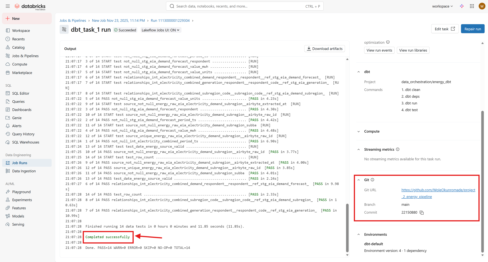

# ⚡ Energy Demand & Supply Data Pipeline  
*A dbt-powered analytics model for EIA Electricity Data*

This repository implements a curated data model for processing electricity demand and generation data from the U.S. Energy Information Administration (EIA). It standardizes raw API data into clean, analytics-ready dimensional models and fact tables for downstream BI and reporting.

---

## Architecture Summary

**Source → Ingestion → Warehouse → dbt → BI**

1. **EIA API** — Electricity demand, generation & subregion metadata  
2. **Airbyte** — Incremental syncing into warehouse raw layer  

3. **Databricks/Snowflake** — Storage in `energy_raw` schema  

4. **dbt** — Transformations via staging, intermediate, dimensions, and fact models  
5. **BI Layer** — Power BI/Tableau for metrics and dashboards  

---

## Schema Overview

The data model captures:

- Time-based energy demand  
- Fuel-type generation data  
- Respondent information  
- Subregional electricity values  
- Daily aggregated demand & supply  
- Net difference between the two (SCD2 tracked)  

The model is structured to support daily and respondent-level analytics.

---

## Core Models

### **1. `date` (Dimension)**
- Breaks timestamps into year, month, day, hour  
- Used as a shared time dimension across facts  

### **2. `demand` (Dimension / Incremental)**
- Electricity demand by respondent, type, timestamp  
- Uses surrogate key generated from respondent + type + date  

### **3. `energy_source` (Dimension / Incremental)**
- Daily MWh generated per fuel type  
- Supports fuel-type analytics (coal, gas, renewables, etc.)  

### **4. `respondent` (Dimension)**
- Utility operators / regions reporting to EIA  

### **5. `subregion`**
- Subregional codes, parent regions, and daily demand  

### **6. `daily_total_demand` (Fact)**
- Aggregates total demand (MWh) per day  

### **7. `daily_total_source` (Fact)**
- Aggregates total electricity generation per day  

### **8. `demand_supply_diff` (Fact / SCD2)**
- Computes net difference (demand – generation)  
- Includes `start_date`, `end_date`, `is_current` for tracking changes  

---

## Relationships

- `respondent` links to demand, generation, and subregion  
- `date` links to all facts  
- Daily demand & supply feed into the net difference fact table  

---

## 14 Data Quality & Tests

The project includes:
- **Not-null tests** on primary fields  
- **Unique key checks** for all dimensions  
- **Relationships** ensuring referential integrity  
- **Custom logic tests** on dates, units, and increments  

This enforces reliability and trustworthy metric output.

---

## BI Outputs
See .pbix file in bi_semantic_layer
The data model supports dashboards for:

- Daily Electricity Demand vs. Daily Generation  
- Net Energy Difference (Surplus/Deficit)  
- Subregional Demand Trends  
- Generation by Fuel Type  

Metrics include:
- **Total Demand (MWh)**  
- **Total Generation (MWh)**  
- **Net Demand–Generation Difference**  

---

## Repository Structure

energy_pipeline/

    ─ data_integration/

    ─ data_transformation/

        ─ dbt/

        ─ staging/

        ─ intermediate/

        ─ marts/

        ─ tests/

    ─ data_model/

        ─ erd.png

        ─ schema_description.md

    ─ bi_semantic_layer/

    ─ docs/
    
    ─ README.md

yaml

---

## Schedule was setup in databricks and runs every two hours. To run dbt manually, 
## cd to project_2\energy_pipeline\data_transformation\dbt_databricks_transformation\energy_dbt

dbt clean
dbt deps
dbt run
dbt test

Airbyte syncs → Warehouse updates → dbt builds → BI refreshes.

